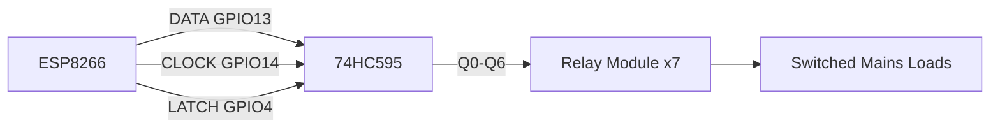

# DIY ESP8266 7-Channel Smart Relay Switch — Build Plan

2026-09-20 · @Fahim

## 1. Project Scope & Design Goals

**Goal**: a WiFi-controlled 7-channel relay switch on ESP8266, local-first, with no cloud dependency — informed by the latency/reliability trade-offs of stock Sonoff hardware (cloud round trips of 150ms–2s vs. 10–50ms for local MQTT).

**Design goals**:

- Local-only control path (MQTT to a self-hosted broker, optional HTTP fallback) — no vendor cloud, no account system.
- Deterministic, fail-safe relay behavior on cold boot and on WiFi/MQTT disconnect (defined precisely in §5) — a network hiccup must never leave a relay in an undefined state.
- OTA-updatable firmware with semantic versioning, so you can patch in the field without re-flashing over UART.
- Mains-isolated relay driving with a GPIO budget that leaves room for a status LED, override button, or future sensor.

**Non-goals**: no cloud account, no mobile app, no on-device touch UI. Remote-outside-LAN access, if ever wanted, is a VPN/reverse-proxy problem layered on top of the local MQTT broker — not something the device itself should handle.

**Update — market release**: this is now scoped as a product, not a one-off build. §9–§13 below add what that changes — certification, a production PCB, an MCU/security reconsideration, manufacturing QA, and fleet OTA. §11 in particular affects the hardware/firmware choices above, so worth reading before locking those in.

## 2. Bill of Materials

| Item | Qty | Notes |
| --- | --- | --- |
| ESP8266 dev board (NodeMCU or Wemos D1 mini) | 1 | 4MB flash minimum — you need OTA headroom for two firmware images |
| 7- or 8-channel relay module, 5V, active-low, opto-isolated inputs | 1 | If it's an 8-channel board, leave one channel unused; confirm opto-isolation, not just a series resistor |
| 74HC595 shift register | 1 | Drives all 7 relays off 3 ESP8266 GPIOs — see §3 for why this beats direct GPIO |
| 5V power supply, certified/enclosed, ≥1.5A | 1 | Sized for worst-case coil draw + ESP8266 WiFi TX peaks (see §4) |
| Decoupling capacitors: 100nF + 10µF | 2–3 | Place near the 74HC595 and the ESP8266 3V3 rail |
| Pull-down resistors (10kΩ) | as needed | On shift-register outputs, so relays default off during power-up glitches before the MCU drives them |
| Mains-rated enclosure with strain relief | 1 | DIN-rail or project box — must physically separate mains wiring from logic-side wiring |
| Terminal blocks | per channel | For load wiring |
| Fuse or breaker | per switched line | Sized to the connected load, independent of the relay's rated contact current |
| Physical override button | optional, 1+ | Wired to a spare GPIO for manual/provisioning control |
| Status LED | optional, 1 | WiFi/MQTT connection state indicator |

## 3. Hardware Architecture & GPIO/Wiring Plan

ESP8266 exposes roughly 9 usable GPIOs, and several are boot-strapping pins (GPIO0, GPIO2, GPIO15) with constraints at reset. Driving 7 relays directly off GPIOs is fragile — a relay coil loading a strap pin during power-up risks the board entering the wrong boot mode or the relay chattering before firmware even runs.

**Recommendation**: drive all 7 relays through a 74HC595 serial-in/parallel-out shift register. Only 3 ESP8266 GPIOs are needed:



This frees GPIO0 (provisioning button), GPIO2 (status LED), and GPIO16 (wake/misc) for other uses without touching the relay logic at all.

**Wiring notes**:

- Never bridge the mains-switching side and the logic side beyond the relay module's opto-isolator boundary — treat the isolated section as if it were a separate PCB.
- Verify the relay module has flyback/snubber protection on its coil driver transistor (most Songle-relay modules do) before assuming it — check with a diode/continuity test.
- Reserve GPIO0 as a hold-on-boot provisioning button: hold low during power-up to enter WiFiManager AP mode, matching the fail-safe boot design in §5.
- Keep mains wiring on one physical side of the enclosure, separated from the ESP8266/shift-register side — this is standard electrical-safety practice, not optional.

## 4. Power & Mains Safety Design

- **Coil current budget**: 7 channels × \~70–80mA ≈ 500–560mA worst case (all-on simultaneously), plus ESP8266 WiFi TX peaks (\~200–300mA). Provision a 5V rail rated ≥1.5A, and fuse it downstream of the supply, not just upstream.
- Use a certified, enclosed 5V power supply (UL/CE-rated). Do not build a custom AC-DC stage unless you have specific mains-safety experience — a failure here is a fire/shock risk, not a firmware bug.
- Each switched line needs its **own fuse or breaker sized to the connected load**, independent of the relay's rated contact current — the relay's rating is a ceiling, not a substitute for line protection.
- For any inductive load (motor, contactor coil, transformer-based appliance), confirm the relay module's snubber/EMI suppression is present. An unsuppressed inductive load degrades contacts over time and can inject noise back into the 5V logic rail.
- **Brownout handling**: enable ESP8266's brownout/voltage monitoring so a sagging 5V rail triggers a clean reset rather than leaving a relay latched in an ambiguous, chattering state — this ties directly into the fail-safe boot sequence in §5.

## 5. Firmware Architecture

**Boot sequence**: read persisted per-channel state from flash (LittleFS) → drive the shift register to that state (or a configured fail-safe default) *before* any networking starts, so relays land in a predictable state even if WiFi never comes up.

**Persistence policy**: write channel state to flash only on change, debounced after \~500ms of stability — not on every toggle, to respect flash write-cycle limits (LittleFS wear-leveling helps but isn't unlimited).

**WiFi provisioning**: WiFiManager-style captive portal, entered by holding the provisioning button (GPIO0) during boot — avoids hardcoded credentials and matches the fail-safe design in §3.

**Runtime loop**: non-blocking cooperative state machine (ESP8266 Arduino core has no real RTOS) handling MQTT keep-alive, incoming command dispatch, physical-button debounce, and periodic watchdog feed.

**Watchdog**: the hardware watchdog is active by default in the Arduino core — audit the main loop for any `delay()` longer than \~3s, since that's what actually starves it.

**OTA**: use ArduinoOTA or a self-hosted HTTP OTA endpoint — never a third-party cloud. Store the current version string in flash and expose it over MQTT/HTTP so firmware version is auditable if you ever deploy more than one unit.

**Reconnection behavior**: on WiFi/MQTT disconnect, relay state is left untouched — the fail-safe default applies only at cold boot, never at a transient disconnect. Otherwise a flaky WiFi network turns into a functional outage for a wired appliance.

## 6. Communication Protocol

MQTT over local HTTP polling — mirrors the Tasmota pattern from the earlier Sonoff review, and integrates with Home Assistant/Node-RED with zero cloud dependency.

- **Topics**: publish per-channel state (retained) to `home/switch/<device-id>/<channel>/state`; subscribe for commands on `home/switch/<device-id>/<channel>/set`.
- **Broker**: run locally — Mosquitto on a Pi, NAS, or existing infrastructure — not a cloud broker. Keeps the entire control path on-LAN at sub-50ms.
- **Discovery**: implement Home Assistant MQTT Discovery (`homeassistant/switch/<device-id>/<channel>/config`) so each channel auto-registers as an entity with no manual YAML.
- **Security**: enable TLS plus username/password auth on the broker, or at minimum broker-side ACLs restricting this device to its own topic namespace — local doesn't have to mean unauthenticated.
- **Optional HTTP fallback**: a small `/api/relay/<n>` REST endpoint for direct calls from Node-RED function nodes when you want to bypass MQTT for a specific flow.

## 7. Firmware Skeleton

C++/Arduino core is the pragmatic choice here over MicroPython — mature ESP8266 shift-register, MQTT, and OTA libraries, and lower runtime overhead for a firmware that needs to hit the watchdog and debounce reliably.

```cpp
#define FW_VERSION "1.0.0"  // bump per §8 semver policy

struct RelayState {
  bool channels[7];
  uint32_t lastChangeMs;
  bool dirty;
};

RelayState state;

void setup() {
  loadStateFromFlash(state);      // boot-time restore, before any networking
  shiftRegisterInit();
  shiftRegisterWrite(state.channels);
  wifiManagerBeginOrPortal();     // GPIO0 held => captive portal
  mqttConnect();
  mqttSubscribe("home/switch/+/set");
  ArduinoOTA.begin();
}

void loop() {
  ArduinoOTA.handle();
  mqttLoop();                     // non-blocking keep-alive + dispatch
  handlePhysicalButtons();        // debounced, no blocking delay()

  if (state.dirty && millis() - state.lastChangeMs > 500) {
    persistStateToFlash(state);   // debounced flash write
    state.dirty = false;
  }

  ESP.wdtFeed();                  // explicit feed if any branch risks >3s
}

void onMqttCommand(const char* topic, const char* payload) {
  int channel = parseChannelFromTopic(topic);
  state.channels[channel] = (strcmp(payload, "ON") == 0);
  shiftRegisterWrite(state.channels);   // apply immediately
  state.dirty = true;
  state.lastChangeMs = millis();
  mqttPublishState(channel, state.channels[channel]);  // retained
}
```

Keep `shiftRegisterWrite()` as a single atomic call that pushes all 7 bits in one latch pulse — never toggle channels one at a time with separate latches, or you'll get visible relay chatter across the bank on every multi-channel command.

## 8. Testing, Versioning & Release Plan

- **Bench test** each relay channel individually with a multimeter continuity check before ever connecting a live load — verify shift-register bit order matches your physical channel labeling.
- **Burn-in**: cycle all 7 channels on/off for a 24–48h soak before deployment, to catch early relay or shift-register failures.
- **Versioning**: maintain a `VERSION` file (or `version.h`) with semantic version `MAJOR.MINOR.PATCH`, bumped on every firmware change; embed the string in the OTA manifest and expose it over MQTT/HTTP status so you can audit fleet firmware if you deploy more than one unit.
- **Git tagging**: tag each release commit `vX.Y.Z`; keep a CHANGELOG alongside it.
- **Rollback plan**: keep the previous OTA binary available; require the new image to publish a boot-success heartbeat within N seconds of flashing before treating the OTA push as final — consider a watchdog-triggered auto-rollback if it doesn't check in.

## 9. Regulatory Compliance & Certification

A mains-switching product is not the same undertaking as a personal build — certification is now the actual critical path, more than firmware.

- **RF/EMC (wireless module)**: use a pre-certified module (e.g. ESP-12F/ESP-12S, carrying its own FCC ID/CE mark) and follow its reference antenna keep-out and layout exactly. Adding a shield, moving the antenna, or enclosing it in metal voids the modular certification and forces full-unit RF retesting.
- **Electrical safety**: mains-switching devices generally need formal safety certification before retail sale or professional installation — UL/ETL (UL 60730-1 or UL 1059) in North America, CE marking under the Low Voltage Directive (EN 60730-1 / EN 62368-1) plus the Radio Equipment Directive for the wireless side in the EU, BIS in India, BSTI for the Bangladesh domestic market. Budget real money and time for this: commonly $5,000–$50,000+ and 2–6 months depending on scope and lab.
- **Design for certification**: build to creepage/clearance requirements (IEC 60664) from the first PCB revision — typically ≥3mm clearance / ≥3.2mm creepage at 250VAC for basic insulation, more for reinforced insulation between the mains and logic sections. Retrofitting isolation after a failed test is far more expensive than designing to it up front.
- **Labeling & documentation**: certification bundles in required deliverables — ratings label, installation instructions, EMC/safety test reports. Plan for these as outputs, not afterthoughts.

## 10. Production Hardware: Custom PCB & Manufacturability

The dev-board-plus-breakout approach in §2–3 is right for a prototype; a market product needs a single custom PCB.

- Integrate the WiFi module, the shift register or GPIO expander, per-channel relay drivers (transistor + flyback diode), the isolated power supply, and mains I/O terminals on one board — certification labs test the actual assembly, not a breadboard.
- Route a physical isolation slot between the mains section and the logic section, in addition to meeting minimum creepage distance — a low-cost way labs and reviewers visually confirm the isolation boundary.
- Decide early: on-board isolated SMPS vs. an external certified 5V adapter. External is usually faster to certify overall, since you inherit the adapter's own safety mark, at the cost of an extra enclosure interface and cable.
- Design for panelized SMT assembly and a bed-of-nails/pogo-pin test point layout from the start (§12) — retrofitting test points after layout is finalized is expensive.

## 11. MCU & Security: Reconsidering ESP8266 for Volume Production

Worth flagging before this goes further: **ESP8266 has no secure boot and no flash encryption.** For a personal build that's a non-issue; for a market product it means firmware — and anything in it, including MQTT/broker credentials — can be dumped over UART/SPI by anyone with brief physical access, and cloned onto counterfeit units. There's no cryptographic guarantee a field unit is running firmware you actually signed.

**Recommendation**: move to ESP32 (even the low-cost ESP32-C3) for the production revision — it supports Secure Boot V2 and flash encryption, and lines up with the ESP-IDF toolchain already in your stack, which also means porting the §7 skeleton off the Arduino core onto ESP-IDF directly rather than Arduino-for-ESP32 — more control over secure-boot/flash-encryption configuration, and no framework switch mid-project. Retooling firmware for a different SoC family is far cheaper now than after volume production starts.

If ESP8266 must stay for cost or existing-firmware reasons, at minimum stop embedding any shared secret in the firmware image — provision per-device credentials at manufacturing time instead (§12).

## 12. Manufacturing, Provisioning & QA at Scale

- **Per-device identity**: every unit needs a unique device ID and, ideally, unique WiFi/MQTT credentials injected at manufacturing time — not a single shared secret baked into every firmware image, which turns one leaked unit into a fleet-wide compromise.
- **Provisioning station**: a production-line step that flashes firmware, injects the unique ID/keys, runs a functional test (relay actuation, WiFi association, MQTT round-trip), and serializes/labels the unit before enclosure assembly.
- **Test jig**: a bed-of-nails or pogo-pin fixture for 100% functional test at production — exercising all 7 channels and confirming shift-register bit order against physical labeling, the same check done manually in §8 for a single prototype.
- **Burn-in at volume**: a full 24–48h soak per unit doesn't scale past small batches. Move to statistically sampled burn-in per production lot once volume justifies it, backed by field-failure tracking to catch a bad batch early.

## 13. Fleet OTA & Device Management

- A single-device OTA endpoint (§5) doesn't scale to a market product. You need a device registry, staged/canary rollout (a percentage of the fleet, not all at once), and telemetry that flags a bad firmware push before it reaches every unit.
- This is infrastructure work in its own right, not just a firmware feature — worth scoping as a separate project once volume justifies it.
- Keep the local-first control path (§6) as the product's actual operating mode; the fleet-management/OTA backend should be a separate, optional service layer for updates and diagnostics — never something the relay's runtime control depends on.